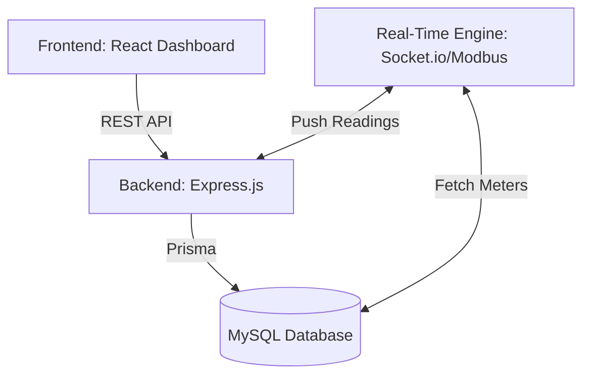

# 🏗️ System Architecture: PowerBill Energy Management

## 1. Technical Stack Overview
### 💻 Frontend (The Visual Hub)
*   React 18 + Tailwind CSS.
*   State management via React Context (`AuthContext`).
*   Data Fetching: `fetch` wrapped in a custom `apiRequest` utility.
*   Visualization: `Recharts` for high-fidelity SVG/Canvas charts.

### ⚙️ Backend (The Intelligent Core)
*   Node.js runtime with Express.js.
*   TypeScript-ready (Current implementation in JavaScript/CommonJS).
*   ORM: **Prisma** for type-safe database access to MySQL.
*   Security: JWT (JSON Web Tokens) with a 7d expiration.

### 🔌 Industrial Interfacing
*   **Protocol Support**: Modbus/TCP and RS485.
*   **Messaging Layer**: Socket.io for immediate (real-time) push of meter readings to connected frontends.
*   **Asynchronous Processing Engine**: Background polling loops for meters, separated from the main request/response cycle.

## 2. Structural Layering

### Component Breakdown
1.  **Auth Controller**: Handles login, registration, and role claims.
2.  **Bill/Consumer Controllers**: Standard CRUD with complex analytics logic for aggregation (Revenue, Units, Trends).
3.  **Middleware Service**: 
    *   `protect`: Verifies JWT validity.
    *   `authorize`: Ensures roles (`ADMIN`, `OPERATOR`, `CONSUMER`) have appropriate permissions.
4.  **Prisma Client**: Singular instance for connection pooling to the Database.

## 3. Communication Strategy
*   **Synchronous**: Standard REST API requests for data retrieval and form submissions.
*   **Asynchronous**: Real-time Socket events for meter "Online/Offline" heartbeat and live consumption increments.

---

*Status: Version 2.5 Architecture Documentation Finalized*
