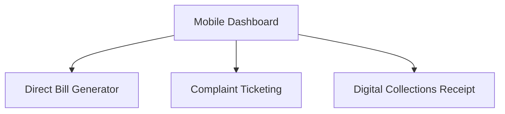

# 🌐 Project Context: PowerBill

This document provides a birds-eye view of the project's background, its purpose, and its strategic goals.

---

## 🚦 **1. Background: Why PowerBill?**
In traditional energy grids, billing is slow and prone to errors. Operators go door-to-door to take manual readings, leading to data entry mistakes and delayed revenue. **PowerBill** was created to modernize this by bringing "Enterprise IoT" to local electricity providers.

## 🌟 **2. Strategic Objectives**
-   **Transparency**: No more "estimated accounts." Every consumer sees their live kWh increments on their dashboard.
-   **Revenue Stability**: Direct "Pay Now" capabilities to ensure liquidity for utility providers.
-   **Grid Diagnostics**: Immediate visualization of node (meter) failures to reduce downtime.
-   **Scalability**: A single backend designed to manage 10,000+ meters without performance degradation.

---

## 🎯 **3. Current Project State**
-   **V1.0 (Completed)**: Core UI, Auth, and Database established.
-   **V2.0 (Completed)**: Real-time dashboard integration and multi-role access control (Admin/Op/Consumer).
-   **V2.5 (Completed)**: **Multi-Meter Mapping Hub** – One consumer can now have multiple meters configured with IP/RS485 settings.
-   **Current Sprint (Ongoing)**: Modbus telemetry engine stability and automated monthly billing batches.

---

## 🛡️ **4. Development Philosophy**
-   **Security First**: RBAC (Role-Based Access Control) is at the heart of every API endpoint.
-   **Responsive Design**: The field operator uses their smartphone. The admin uses their 4K monitor. The system adapts to both seamlessly.
-   **Clean Code**: Decoupled controllers and services for easy maintenance.

---

## 🎨 **5. Logical Architecture & UI Wireframes**

### **A. Administrative Hub (Desktop Context)**
| Component | Functionality |
| :--- | :--- |
| **Primary Sidebar** | Role-based navigation for Grid Monitoring, Consumer CRM, and Billing Engine. |
| **Grid Status Overlay** | Real-time connectivity health map (Online/Offline/Diagnostics). |
| **Analytics Layer** | Multi-dimensional charts showing revenue trends and load distribution. |
| **Configuration Terminal** | Low-level Modbus register mapping and communication protocol setup. |

### **B. Field Operator Hub (Mobile Context)**

### **C. Consumer Portal (Self-Service)**
- **Landing Page**: Real-time current usage (kWh) vs last month.
- **Billing History**: Tabular view of all historic invoices with PDF "Download Receipt" capabilities.
- **Service Desk**: Simple form to raise "High Voltage" or "Disconnected" tickets.

---

*Contact: Kiaan Technology Team (support@kiaantechnology.com)*
*Status: Ecosystem Context V1.5 Documented*
