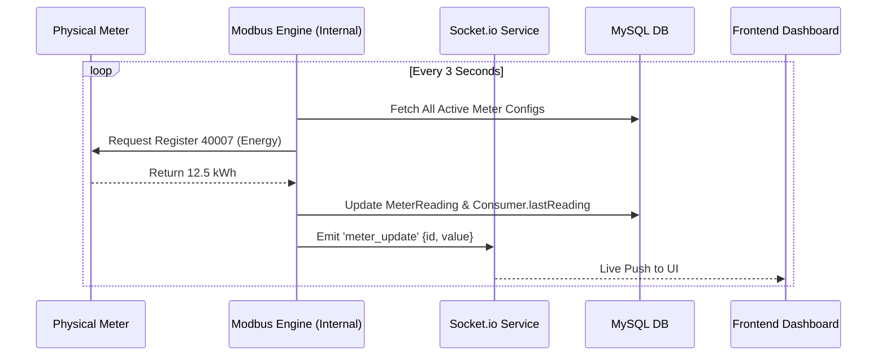

# 🔄 System Logic Flows: PowerBill

This document outlines the core business logic paths within the application.

## 1. Meter-to-Consumer Setup Flow
**Goal**: Successfully map a physical Modbus device to a digital Consumer profile.

1.  **Input Detail**: Admin enters Consumer Name/Email + Meter Serial/IP/Port/SlaveID in a single form (**Add Consumer**).
2.  **Backend Creation**: 
    -   `prisma.user.create` (Role: `CONSUMER`).
    -   `prisma.consumer.create` (with User ID).
    -   `prisma.meter.create` (with Consumer ID and Hardware settings).
    -   **Standard Registers**: Automatically create registers for Voltage (`40001`), Current (`40003`), Power (`40005`), Energy (`40007`).
3.  **Frontend Notification**: Success toast and redirect to Grid Monitor.

## 2. Real-Time Telemetry Polling Flow
**Goal**: Continuous update of the dashboard with live kWh data.

## 3. Automated Billing Cycle Flow
**Goal**: Convert consumption to revenue.

1.  **Reading Fetch**: `bill.controller` gets `currentReading` (from IoT) and `previousReading` (from DB).
2.  **Calculation**: `(current - previous) * Rate per kWh + Fixed Tax`.
3.  **Bill Entry**: New `Bill` record created (Status: `PENDING`).
4.  **Notification**: `Notification` entry created for the consumer's dashboard.

## 4. Payment & Recovery Flow
**Goal**: Transparently mark bills as paid.

1.  **Payment Initiation**: Consumer selects a pending bill and clicks "Pay Now".
2.  **Validation**: Backend verifies the bill status and amount.
3.  **Transaction Record**: New `Payment` entry created (Status: `SUCCESS`).
4.  **Finalization**: Corresponding `Bill` status updated to `PAID`.
5.  **Receipt**: Consumer downloads **PDF Receipt** generated by the frontend using `jsPDF`.

---

*Status: Critical Logic Flows V1.2 Finalized*
